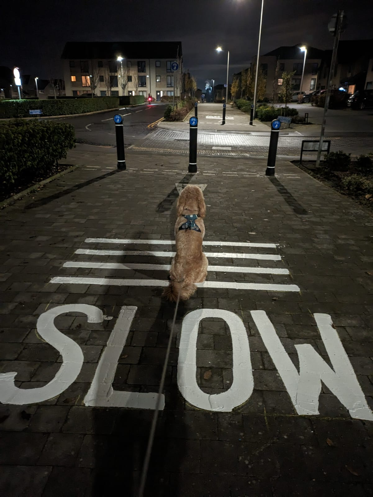

= Slow down
Eddie
26th February 2024
:source-highlighter: rouge
:nofooter:

link:index.html[[back]]

++++

++++

== Dogs that debug

Chewie has no idea how many solutions he's paired with me on, but it's a lot!

.Photo by Lidia Stopińska-Cherek

_Breakthroughs_ just seem to come that more readily during the times where I take a break from the screen and _Just. Slow. Down._ For a bit. 

I can see it being exactly the sort of pseudo-sagelike guidance I might have rejected earlier in my career but I definitely vouch for it now: find a non-computer-related thing that lets you defrag your thoughts during breaks and do it. Maybe the breakthroughs will magically appear for you too.

Noonefootnote:[based on a sample set of 1] everfootnote:[during the years '04 - present] got Employee of the Yearfootnote:[if that is actually a thing] for eating lunch at their deskfootnote:[it's possible other factors were at play such as excessive time spent walking dogs].
 

